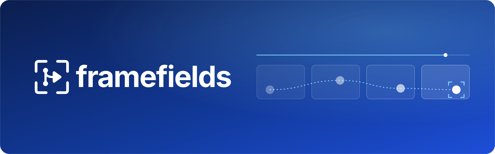
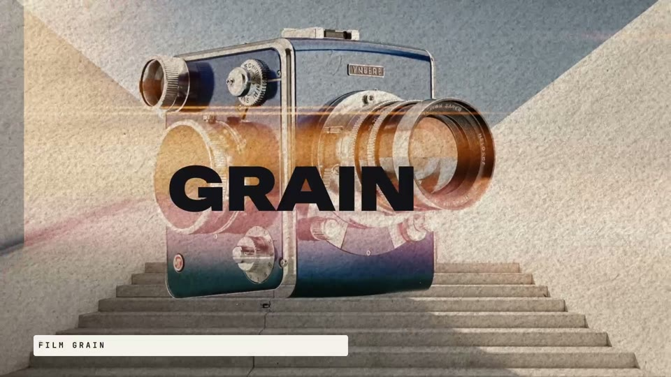
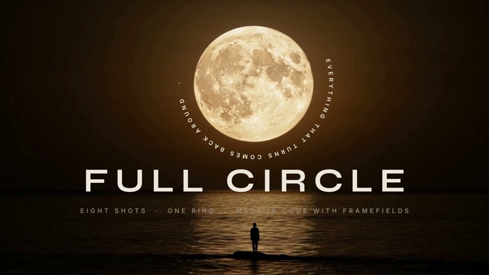
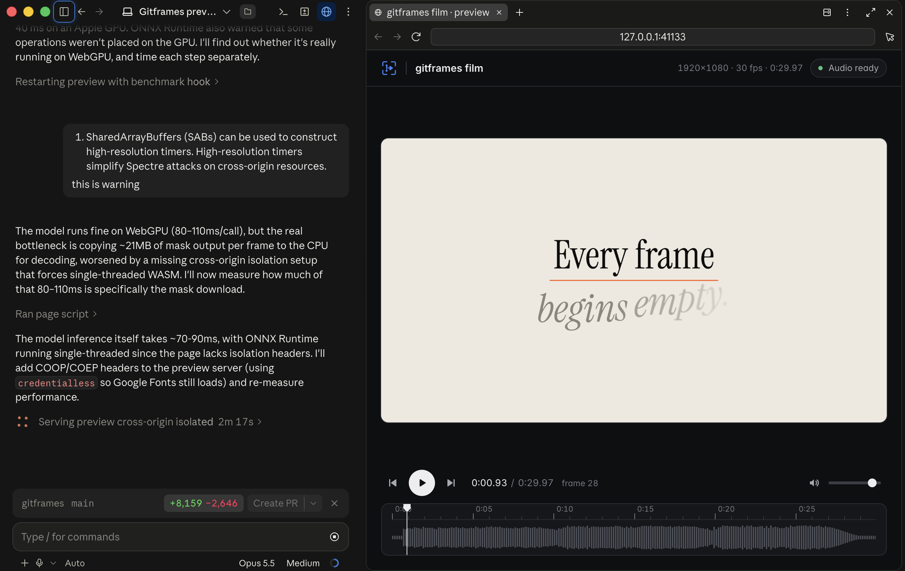

<div align="center">



**Compositing, motion graphics and 3D for code-first video — one npm package that AI agents drive with code.**

[](https://www.npmjs.com/package/gitframes)
[](LICENCE)
[](#)
[](https://discord.gg/cbqMGGme5)
[](https://www.youtube.com/@gatewai.studio)
[](https://nodejs.org)
[](https://www.w3.org/TR/webgpu/)
[](#monorepo-architecture)
[](#6-on-device-vision--tracking)

> **⚠️ Beta:** gitframes is under active development. APIs may change between releases and some features may be incomplete or unstable.

Gitframes is built for coding agents. It packs the work people usually split across three desktop apps (Photoshop-inspired compositing and VFX, After Effects-style motion, typography and keyframing, and Blender-style 3D scenes, cameras and models) into one lightweight npm package. Your agent writes a TypeScript composition, checks frames, and renders an MP4, and nobody has to install or license a multi-gigabyte creative suite.

**Code-first video as pure software engineering** — no headless browser, no DOM reflow, no screenshot pipeline.
Renders directly on GPU hardware via Dawn / WebGPU / Metal / Vulkan in Node.js and modern WebGPU browsers.

</div>

### Made with gitframes

Every frame of these films is rendered by gitframes from TypeScript in [`examples/`](examples). Click a still to watch it on YouTube.

<table>
  <tr>
    <td width="33%" align="center">
      <a href="https://youtu.be/w6IQNrhJJek"></a>
      <br><a href="https://youtu.be/w6IQNrhJJek"><b>Gitframes launch</b></a>
      <br><sub><a href="examples/22_gitframes_launch"><code>22_gitframes_launch</code></a></sub>
    </td>
    <td width="33%" align="center">
      <a href="https://youtu.be/YeIpp4xf_j8"></a>
      <br><a href="https://youtu.be/YeIpp4xf_j8"><b>Full Circle</b></a>
      <br><sub><a href="examples/21_full_circle"><code>21_full_circle</code></a></sub>
    </td>
    <td width="33%" align="center">
      <a href="https://youtu.be/R5Zug49FTTQ"></a>
      <br><a href="https://youtu.be/R5Zug49FTTQ"><b>Dancer showcase</b></a>
      <br><sub><a href="examples/19_gitframes_film"><code>19_gitframes_film</code></a></sub>
    </td>
  </tr>
</table>

> [!NOTE]
> **Using an AI coding agent?** Install the gitframes skills in one line.
>
> **Claude Code**
> ```text
> /plugin install gitframes
> ```
>
> **Any other agent** (Codex, Cursor, Hermes, Gemini CLI, Copilot, and more)
> ```bash
> npx skills add gatewai-dev/gitframes
> ```
>
> See [Agent Skills & Plugins](#agent-skills--plugins) for details.

---

## Table of Contents

- [Why Gitframes](#why-gitframes)
- [Architectural Comparison](#architectural-comparison-gitframes-vs-remotion-vs-hyperframes)
- [Key Features & Capabilities](#key-features--capabilities)
  - [1. Slug GPU Vector Typography & After Effects Animators](#1-slug-gpu-vector-typography--after-effects-animators)
  - [2. Photoshop-Inspired WebGPU 2D VFX](#2-photoshop-inspired-webgpu-2d-vfx-50-shaders)
  - [3. Unified 3D Scene Graph, Camera & Mesh Shading](#3-unified-3d-scene-graph-camera--mesh-shading)
  - [4. Audio Layers, Procedural SFX & Reactive Signals](#4-audio-layers-procedural-sfx--reactive-signals)
  - [5. Animated Charts](#5-animated-charts)
  - [6. On-Device Vision & Tracking](#6-on-device-vision--tracking)
  - [7. Headless Conformance & FrameGrid Testing](#7-headless-conformance--framegrid-testing)
  - [8. Live Preview in the Browser](#8-live-preview-in-the-browser)
- [Monorepo Architecture](#monorepo-architecture)
- [Quickstart Guide](#quickstart-guide)
  - [1. Basic Composition & Kinetic Auto-Layout](#1-basic-composition--kinetic-auto-layout)
  - [2. Unified 3D Scene with Camera & 3D Model](#2-unified-3d-scene-with-camera--3d-model)
  - [3. Audio Soundtrack, Procedural SFX & Reactive Signals](#3-audio-soundtrack-procedural-sfx--reactive-signals)
  - [4. Chained WebGPU Post-Processing VFX](#4-chained-webgpu-post-processing-vfx)
  - [5. Vision: Pin, Matte & Reframe](#5-vision-pin-matte--reframe)
  - [6. Headless Video & FrameGrid Rendering](#6-headless-video--framegrid-rendering)
- [Engineering Doctrines & Best Practices](#engineering-doctrines--best-practices)
- [Agent Skills & Plugins](#agent-skills--plugins)
- [Reference Showcase Examples](#reference-showcase-examples)
- [Development & Building](#development--building)
- [Community](#community)
- [License](#license)

---

## Why Gitframes

Modern automated video generation is usually constrained by the architectures of general-purpose web browsers: process overhead, non-deterministic DOM layout reflows, and slow screenshot capture. Gitframes treats **video composition as software engineering**:

| | Pillar | What it means |
|---|---|---|
| 🚀 | **Zero Headless-Browser Overhead** | No Puppeteer, no Chromium IPC, no `page.screenshot()`. Gitframes talks straight to native GPU devices via Dawn/WebGPU and hardware-encodes with `@napi-rs/webcodecs`. |
| 🎯 | **Deterministic Frame-Accurate Clock** | Absolute frame clocks, discrete sample points, and frame-accurate audio BeatGrids. No floating timers, no drift, no dropped frames. |
| 🔠 | **Analytic, Resolution-Independent Type** | The Slug algorithm evaluates glyph contours per-pixel in WGSL — no texture atlases, no scaling artifacts, razor-sharp from 10 px to 10,000 px. |
| 🎨 | **Photoshop-Inspired Tonal & Spatial VFX** | 50+ modular GPU shaders: Curves, Levels, Selective Color, 3D LUTs, Halftone, Film Grain, Unsharp Mask, Mesh Warp, and Screen-Space Relighting. |
| 🧊 | **Unified 3D & 2D Depth Compositing** | Nest 2D flex/box trees inside 3D homography planes, multiplane rigs, and meshes (OBJ, FBX, glTF/GLB, STL, PLY, VOX, 3DS, OFF), with PBR glass and SSAO. |
| 🔊 | **Built-in Procedural Audio DSP** | Multi-track soundtracks, deterministic procedural transition SFX (whoosh, impact, riser), and reactive signals that drive visuals from audio. |
| 👁️ | **On-Device Neural Vision** | Object tracking, instance segmentation, multi-person pose, and person mattes from Apache-2.0 ONNX models — feeding reactive signals without a round trip to disk. |
| ☁️ | **Cloud-Native & CI/CD Ready** | ~200–400 MB RAM per worker (vs. 2–4 GB for Chromium), ideal for serverless GPU render clusters (AWS G4/G5, Modal, RunPod, Kubernetes). |

---

## Architectural Comparison: Gitframes vs. Remotion vs. Hyperframes

Developers generating video programmatically commonly weigh **Remotion** (React/Chromium) or **Hyperframes** (Canvas2D/SVG web animation). The matrix below compares the fundamental engineering dimensions.

### Detailed Comparison Matrix

| Capability / Dimension | **Gitframes** | **Remotion** | **Hyperframes** |
|---|---|---|---|
| **Underlying Engine** | **Native WebGPU** (WGSL compute & render pipelines via Dawn / Metal / Vulkan) | **Chromium / Puppeteer** (React DOM, HTML/CSS layout) | **Canvas2D / WebGL / SVG** (browser or Node Skia) |
| **Rendering Architecture** | Direct hardware framebuffer rendering & hardware video encoding (`@napi-rs/webcodecs`) | Spawns headless Chrome; captures frames via CDP / `page.screenshot()` | Software or hardware 2D canvas context |
| **Throughput** | **60–120+ FPS** (real-time to faster-than-real-time GPU execution) | **5–20 FPS** (DOM reflow, IPC, rasterization) | **20–40 FPS** (CPU draw commands / JS) |
| **Memory Footprint** | **~200–400 MB** per render (zero browser) | **1.5–4.0 GB+** per worker (Chromium + V8 DOM heap) | **~500 MB–1 GB** (Skia/Canvas bindings) |
| **Typography Engine** | **Slug GPU** — analytic Bézier evaluation in WGSL, infinite zoom, After Effects selectors | Browser DOM text (CSS fonts, rasterized, blurry under 3D transforms) | Canvas2D / path text (CPU-rasterized glyphs) |
| **2D VFX & Post-Processing** | **50+ WebGPU shaders** (Curves, Levels, Selective Color, 3D LUT, Film Grain, Halftone, Liquify, PBR Glass, Relight) | CSS Filters or custom WebGL canvas wrappers | Basic Canvas2D composites and 2D filters |
| **3D Graphics & Depth** | **Native 3D scene graph** — LookAt/Turntable camera, multiplane, skinning (OBJ/FBX/glTF), SSAO, PCSS, DoF | None built-in (embed Three.js/Fiber inside React DOM) | Minimal 2.5D layers; no unified mesh pipeline |
| **Motion Blur & Physics** | Physical 180° shutter velocity buffers in MRT + closed-form spring kinematics | CSS transitions / JS interpolation; synthetic blur hacks | Frame interpolation or manual multipass |
| **Audio Engine & DSP** | Native audio DSP & procedural SFX (multi-track mixing, beat grids, reactive signals) | `<Audio>` playback; basic volume curves | Basic static audio playback |
| **Charts & Data Viz** | **`Layer.chart`** — line, area, bar, scatter, candlestick, pie and donut charts built from native vector nodes, with staggered reveal animations | DOM chart libraries (Recharts, Chart.js) | Custom canvas draw operations |
| **AI & Computer Vision** | **On-device ONNX vision** — COCO-80 detection + instance masks (RTMDet-Ins), COCO-17 pose (RTMO), person mattes (Selfie Segmenter); WebGPU tensor conditioning (Canny, depth-to-normals, optical flow, deflicker) | External pre-rendered assets; no native GPU tensor conditioning | External pre-rendered assets |
| **Headless Verification** | **FrameGrid contact sheets**, single-frame snapshots, Skia MSE pixel-invariant assertions | Playwright/Puppeteer visual snapshots | Manual frame inspection / canvas diffing |
| **Docker / Cloud Portability** | **Compact** (~500 MB slim image with native GPU/Vulkan drivers) | **Heavy** (~2–3 GB with Chromium, fonts, X11/Mesa) | Moderate container size |

---

## Key Features & Capabilities

### 1. Slug GPU Vector Typography & After Effects Animators
Traditional text relies on CPU rasterization or low-res SDF atlases that soften under 3D camera sweeps. Gitframes integrates the **Slug algorithm** ([`SlugPipeline`](packages/webgpu-renderers/src/slug/slug-pipeline.ts)):
- **Analytic GPU evaluation** — WGSL fragment shaders solve exact cubic/quadratic Béziers per-pixel. Glyphs stay sharp at 10 px or 10,000 px with zero CPU re-rasterization.
- **After Effects–style animators** — range selectors (`square`, `ramp_up`, `ramp_down`, `triangle`, `smooth`), `easeHigh`/`easeLow` curves, and seeded PRNG character shuffling ([`TextAnimator`](packages/gitframes/src/index.ts)).
- **Human typing cadence** — weighted punctuation delays (commas 3×, sentence ends 5.5×, newlines 7×) and trailing scramble resolution ([`TypewriterAnimator`](packages/gitframes/src/index.ts)).
- **3D volumetric formations** — map text onto cylindrical drums, logarithmic vortex spirals, and double-helix ribbons with surface-normal banking ([`evaluateVolumetricFormation`](packages/gitframes/src/index.ts)).
- **Dynamic leading & skew** — area-preserving unimodular shear and accordion line-leading anchored to baseline, center, or top.

### 2. Photoshop-Inspired WebGPU 2D VFX (50+ Shaders)
A comprehensive suite of professional image/video shader nodes in [`nodes/`](nodes) and [`packages/webgpu-renderers`](packages/webgpu-renderers):
- **Tonal grading** — Curves (RGB/R/G/B spline), Levels (black/white point, gamma, output), Shadows/Highlights, Selective Color (CMYK gamut isolation), 3D Cube LUT ([`ApplyLUT`](packages/gitframes/src/effects)).
- **Stylization & grain** — Film Grain (Gaussian emulsion with spatial seed variation), Halftone (mono/RGB/CMYK, adjustable dot shape & angle), Gradient Map, High Pass.
- **Optics & lens** — Bilateral Gaussian Blur, Unsharp Mask, Vignette, Refraction Caustics, PBR Glassmorphism with chromatic dispersion ([`PBRGlass`](packages/gitframes/src/effects)).
- **Distortion & warping** — Displacement Maps, Liquify, Mesh Warp, Corner Pin homography.

### 3. Unified 3D Scene Graph, Camera & Mesh Shading
- **Calibrated camera rig** — LookAt and Turntable cameras ([`Camera3D`](packages/webgpu-renderers/src/math3d/camera3d.ts)) calibrated so `z = 0` matches 2D canvas pixel coordinates 1:1.
- **3D layout primitives** — [`Layer3D.cube`](packages/gitframes/src/shapes3d.ts), `carousel`, `prism`, `plane`, `grid` with unified depth-buffer testing.
- **Zero-dependency model parsers** — OBJ, FBX, glTF/GLB, STL, PLY, VOX, 3DS, OFF.
- **Skeletal animation & shading** — 128-bone Linear Blend Skinning, Blinn-Phong & PBR multi-light shading, PCSS/Poisson contact shadows, SSAO, and optical DoF.
- **Physical motion blur** — 180° shutter motion blur with per-vertex velocity vectors packed into `rg16float` MRT buffers.

### 4. Audio Layers, Procedural SFX & Reactive Signals
- **Soundtrack layers** — `.audio` media nodes with frame-exact lifecycle control.
- **Procedural SFX** — deterministic CPU-synthesized whooshes, impacts, risers, downshifters, and glitches placed on the bar/beat grid (`renderSfx`, `mixSfxInto`, `softLimit`).
- **Multi-track mixing** — master tracks headlessly with `mixAudioTracks` and `encodeStereoWav`.
- **Reactive signals** — drive transforms, scale, borders, or shader uniforms from tempo signals (`Signal.builder`) or audio analysis.

### 5. Animated Charts
[`Layer.chart`](packages/gitframes/src/chart.ts) builds line, area, bar (grouped or stacked), scatter, candlestick, pie and donut charts. [d3](https://d3js.org) computes the scales, ticks and geometry; every bar, line, slice and label is an ordinary box, path or text node:
- Labels use the composition's registered fonts and the same GPU text renderer as the rest of the film.
- A built-in reveal draws lines on, grows bars from the baseline and staggers points and slices (`animate: { start, duration, stagger, ease }`, or `animate: false`).
- The chart is one box, so it positions, animates, grades and tilts into 3D like any other layer.

```typescript
Layer.chart(
  {
    type: "bar",
    width: 900,
    height: 480,
    categories: ["Q1", "Q2", "Q3", "Q4"],
    series: [
      { name: "Revenue", data: [12, 19, 24, 31] },
      { name: "Costs", data: [8, 11, 13, 15] },
    ],
    yAxis: { format: "$,.0f" },
    animate: { start: 10, duration: 30 },
  },
  { position: "absolute", x: 120, y: 200 },
);
```

### 6. On-Device Vision & Tracking
[`@gitframes/vision`](packages/vision) runs ONNX models via `onnxruntime-node` (CPU) or `onnxruntime-web` (WebGPU) and wires every result into the same reactive signal surface the rest of Gitframes consumes.

> [!TIP]
> **Lazy by construction.** `VisionRunner.create()`, `comp.withVision(...)` and `VisionNode.attach(...)` perform **zero I/O** — no downloads, no sessions, no file probes. A model is fetched the first time a task actually runs. To warm up ahead of time, call `await runner.preload(["detect", "pose"])` (or `await vision.ready()` on an attached node).

#### Tasks and models

Every model is **Apache-2.0**, pinned to an immutable Hugging Face revision, and verified by SHA-256 after download.

| Task | Option | Model | Output |
|---|---|---|---|
| **Detect** | `enableDetection` | RTMDet-Ins `t/s/m` (OpenMMLab) | COCO-80 boxes + scores, tracked over time |
| **Segment** | `enableSegmentation` | RTMDet-Ins (same forward pass as detect) | Soft per-instance masks, frame-aligned |
| **Pose** | `enablePose` | RTMO `t/s/m` (OpenMMLab) | 17 COCO keypoints + visibility per person |
| **Matte** | `enableMatte` | MediaPipe Selfie Segmenter (Google) | Fast person-vs-background alpha for portrait / webcam framing |

- **Variants** — `variant: "t" | "s" | "m"` (default `"s"`; ~24 / 43 / 116 MB for RTMDet-Ins). Tune `confidence` and a COCO `classes` filter per composition. On CPU, a 2K frame takes roughly 200–340 ms to detect + segment, ~120 ms for pose and ~20 ms for the matte with `"s"`.
- **One pass, two tasks** — detection and segmentation share a single RTMDet-Ins inference per frame.
- **Picking a matte** — the Selfie Segmenter is tuned for a person filling much of the frame: it misses distant figures and can report "person" on close-ups with nobody in them. For anything else, cut out with instance masks (`matteSource: "instance"`, the default).
- **Whole-subject cutouts** — `mask` / `matte` / `crop` modes merge every comparably sized instance that overlaps the main subject, so a flowing dress or a held instrument stays attached to the person, while a tunnel or window framing them does not.
- **One-frame delay** — vision reads each layer's previous rendered frame, so results trail the plate by one frame and frame 0 has none. Verify vision layers with the exported video or consecutive frames, not frame grids.
- **Model cache & mirrors** — models are cached atomically (temp + rename) in `$GITFRAMES_MODELS_DIR` (default `~/.cache/gitframes/models`). Point `baseUrl` or `GITFRAMES_MODELS_BASE_URL` at your own mirror for air-gapped or CI renders.

#### GPU helpers
- **OpenPose-style skeleton textures** — rasterize COCO-17 keypoints into a VRAM conditioning texture ([`PoseSkeletonRenderer`](packages/vision/src/gpu/pose-skeleton-renderer.ts)).
- **GPU segmentation texture pool** — reusable silhouette textures ([`SegmentationTexturePool`](packages/vision/src/gpu/segmentation-texture-pool.ts)).

#### Temporal tracking & analysis
- **Multi-object tracker** ([`TemporalObjectTracker`](packages/vision/src/tracking/temporal-object-tracker.ts)) assigns stable `trackId`s via IoU association, with configurable `minHits`, `positionSmoothing`, and velocity-based **coasting** for up to `maxMissedFrames` (default 15) so a transient miss holds the track instead of flashing.
- **Pose↔track matching** ([`pose-track-matcher`](packages/vision/src/tracking/pose-track-matcher.ts)) binds keypoints to the right track by id, then by spatial IoU fallback.
- **One-shot sequence analysis** — `comp.analyzeVisionSequence(src, { tasks, categories })` decodes frames through the mediabunny pipeline, tracks them, and returns a **zod-serializable** report (per-track frame ranges, mean speed, sampled center paths, per-class presence/confidence, mean mask coverage, model download bytes/timing) ([`analyzeSequence`](packages/vision/src/analysis/analyze-sequence.ts)).

#### Reactive vision signals
Every tracked entity is exposed as reactive `ProgrammaticSignal`s that animate layers and shader uniforms:

| Group | Highlights |
|---|---|
| `objects` | `get(trackId)`, `byCategory(cat, rank)`, `primary`, `count`, `hasCategory`, `detectedCategories` |
| `objects.*.bounds` | `x/y/width/height`, `screenX/screenY/screenWidth/screenHeight`, `aspectRatio`, `area` |
| `objects.*.anchors` | 9 anchors (corners, edges, center) ready for pinning |
| `objects.*.kinematics` | `vx`, `vy`, `speed`, `acceleration`, `headingRad/Deg` |
| `objects.*.pose` | All 17 COCO keypoints, plus `hasPose`, `wristSpeed`, `handRaised`, `bodyTiltAngle` |
| `masks` | `get(trackId)`, `subject`, `count`; per-mask `area`, `coverage`, `solidity`, `bboxFill` |
| `segmentation` | `subject`, `humanSilhouette`, `instanceMasks`, `matte.coverage`, GPU `stencilTexture` |
| `classes` | Per-class `count`, `maxConfidence`, `present`, `primary`, plus a detection `histogram` |
| Tensors | `poseLandmarksTensor [17,3]`, `objectsTensor [16,8]`, `masksTensor [16,2]`, `histogramTensor [80]` |

#### Spatial pinning
Project normalized landmarks to screen space with a configurable camera FOV, then bind any node to a track or landmark ([`SpatialLandmarkTransformer`](packages/vision/src/spatial/camera-space-transformer.ts), [`spatial-pin`](packages/vision/src/spatial/spatial-pin.ts)):
- `pinToObject(track, { anchor, offsetX/Y/Z, matchWidth, matchHeight, smoothFrames, hideWhenLost })`
- `pinToLandmark(coord, { offsetX/Y/Z })`

#### High-level composition helpers
- **Subject Sandwich** — `comp.addSubjectSandwich({ source, behind, feather, fit })` cuts the foreground subject out and places typography/graphics behind them.
- **Smart Reframing** — `comp.addSmartFraming({ source, target, targetAspect, damping, leadHeadroom })` auto-crops 16:9 → 9:16 while tracking `target`.
- **Subject Outline** — `comp.addSubjectOutline(vision.segmentation.subject, { source, color, width, blur })` strokes the segmented boundary as an audio-reactive contour glow.
- **Tracked Region Blur** — `layer.blurRegion(track, { strength })` blurs faces, plates, or any detected class.
- **Node modes** — `passthrough`, `mask`, `matte`, `crop`, `skeleton`, `boxes`, `tracking`; pick the cutout alpha with `matteSource: "instance" | "selfie"`, and optionally `keyBackground` to grow the subject into connected foreground.

#### Agent-first DX
- **Runtime config is zod-validated** and available from a **zod-only entry** (`@gitframes/vision/schemas`) so the hot path stays zod-free. Unknown or removed options are rejected, not silently ignored.
- **`vision.summary(frame)`** returns a deterministic, serializable snapshot (objects, classes, masks) safe to call inside a frame hook.
- **Clear failures** — a model that is the wrong size, fails its checksum, or lacks an expected output raises an error naming the model and its source.
- **Browser entry** — `@gitframes/vision/web` re-exports the engine plus `createWebGPUProvider()` / `hasWebGPU()`; `onnxruntime-web` is an optional lazy peer.

### 7. Headless Conformance & FrameGrid Testing
- **Pixel-sampling invariant assertions** — test compositions in Vitest with `skia-canvas` to verify shader math, font coverage, and Mean Squared Error (MSE) temporal deltas.
- **FrameGrid contact sheets** — `comp.renderFrameGrid(...)` outputs sequential-frame contact sheets for instant review of easing, kinetic type, and transitions.

### 8. Live Preview in the Browser
- **Runs your composition, not a video** — `startPreview({ entry, export })` serves a localhost WebGPU player that loads the composition's own module and renders every frame live in the browser. Nothing is streamed: the server only hands over the bundle, the project's assets, and the soundtrack mixed by the export engine.
- **Timeline, waveform & frame stepping** — play/pause, scrub, step frame by frame, and read resolution, FPS, duration, and audio status at a glance.
- **One stable URL per project** — the port is derived from the working directory, so re-running the preview replaces the running server and any open tab reloads into the new version by itself. Close the tab and the server shuts down about five seconds later.
- **Shown where you are** — `startPreview` serves the page and returns its URL instead of opening a browser, so an agent can show it in its own pane (Claude Code, Codex); pass `open: true` to open the system browser.

```typescript
import { startPreview } from "gitframes";

const session = await startPreview(
  { entry: new URL("./film.ts", import.meta.url), export: "buildFilm" },
  { title: "gitframes film" },
);
console.log(`Preview at ${session.url}`);
await session.closed; // serves until its tab closes or a newer preview takes over
```



---

## Monorepo Architecture

Managed with `pnpm` workspaces and `turbo`:

```
gitframes/
├── packages/
│   ├── gitframes/              # Unified SDK (Composition, Layer, LayerAnimation, Signal, effects)
│   ├── core/                   # Core AST, Effect base class, VirtualMediaData, vision types
│   ├── compositions/           # Layout engine, Flex/Box AST compiler, timeline evaluator
│   ├── webgpu-renderers/       # WGSL shaders, Slug text engine, 3D renderer, camera, lights, materials
│   ├── tensor-webgpu/          # WebGPU compute pipelines (Canny, depth-to-normals, flow, deflicker, landmarks)
│   ├── vision/                 # ONNX vision engine: detect, segment, pose, matte, tracking, signals
│   ├── renderer/               # Headless Node.js WebGPU renderer via Dawn, WebCodecs, skia-canvas
│   ├── renderers/              # Higher-level render orchestration
│   ├── media/                  # Media decoding / encoding adapters
│   ├── node-sdk/               # Node renderer contracts and result schemas
│   ├── server-utils/           # Server infrastructure, storage, asset caches
│   └── client-utils/           # Shared browser utilities
├── nodes/                      # 58+ specialized domain nodes (VFX, audio, layout, node-vision)
├── apps/
│   └── renderer-service/       # Production HTTP / gRPC rendering microservice container
├── examples/                   # Reference compositions and films
├── plugins/gitframes/          # Agent plugin: skills only (setup, compose, effects, render)
└── scripts/                    # Build, release, and plugin validation tooling
```

---

## Quickstart Guide

### Installation

```bash
pnpm add gitframes
```

> **Requirements:** Node.js ≥ 22. Gitframes uses native GPU acceleration via Dawn / WebGPU or Vulkan.

---

### 1. Basic Composition & Kinetic Auto-Layout

```typescript
import { Composition, Layer, LayerAnimation } from "gitframes";

// 1. Initialize a 1080p60 composition
const comp = new Composition({
  width: 1920,
  height: 1080,
  fps: 60,
  durationFrames: 180, // 3 seconds
  backgroundColor: "#090a0f",
  fonts: ["assets/fonts/Inter.ttf", "assets/fonts/SpaceGrotesk.ttf"],
});

// 2. Define physical snap-overshoot animations
const cardEntrance = LayerAnimation.create()
  .fadeIn(0, 20, "power2.out")
  .fromTo("y", 60, 0, { start: 0, end: 35, ease: "back.out(1.5)" })
  .fromTo("scale", 0.92, 1.0, { start: 0, end: 35, ease: "back.out(1.2)" });

// 3. Assemble a responsive flex-layout card
const heroCard = Layer.box({
  width: 720,
  height: 380,
  background: "#141721",
  borderRadius: 24,
  borderColor: "#262b3d",
  borderWidth: 1.5,
  padding: 32,
  children: [
    Layer.flex({
      dir: "column",
      gap: 16,
      children: [
        Layer.text("GITFRAMES ENGINE", {
          fontSize: 16,
          fontWeight: 700,
          fill: "#6366f1",
          letterSpacing: 2.0,
        }),
        Layer.text("Next-Gen WebGPU Motion", {
          fontSize: 48,
          fontWeight: 700,
          fill: "#f8fafc",
          fontFamily: "SpaceGrotesk",
        }),
        Layer.text("Direct hardware video composition without headless browser overhead.", {
          fontSize: 20,
          fill: "#94a3b8",
          lineHeight: 28,
        }),
      ],
    }),
  ],
}).animate(cardEntrance);

comp.add(heroCard);
```

---

### 2. Unified 3D Scene with Camera & 3D Model

```typescript
import { Composition, Layer, Layer3D, CameraAnimation, Light } from "gitframes";

const comp = new Composition({ width: 1920, height: 1080, fps: 60, durationFrames: 300 });

// 1. LookAt 3D camera with a continuous orbit
const cameraAnim = CameraAnimation.camera().orbit({
  azimuth: { from: -30, to: 30 },
  elevation: { from: 15, to: 15 },
  radius: { to: 1200 },
  start: 0,
  end: 300,
});

comp.add(
  Layer.camera({ x: 960, y: 540, z: -1000, targetX: 960, targetY: 540, targetZ: 0 }).animate(cameraAnim)
);

// 2. Studio lighting
comp.add(Light.ambient("#ffffff", 0.4));
comp.add(Light.directional({ color: "#e0e7ff", intensity: 1.2, x: 500, y: -800, z: -600 }));

// 3. 3D model with skeletal animation
comp.add(
  Layer.glb("assets/models/character.glb", {
    x: 960,
    y: 640,
    z: 0,
    scale: 2.5,
    material: "lit",
    loop: true,
  })
);

// 4. 3D prism layout carousel
comp.add(
  Layer3D.carousel({
    radius: 400,
    items: [
      Layer.box({ width: 280, height: 180, background: "#1e293b", borderRadius: 16 }),
      Layer.box({ width: 280, height: 180, background: "#334155", borderRadius: 16 }),
      Layer.box({ width: 280, height: 180, background: "#0f172a", borderRadius: 16 }),
    ],
  })
);
```

---

### 3. Audio Soundtrack, Procedural SFX & Reactive Signals

```typescript
import { Composition, Layer, LayerAnimation, Signal, renderSfx, mixSfxInto, softLimit } from "gitframes";

const comp = new Composition({ width: 1920, height: 1080, fps: 60 });
const totalFrames = 240;

// 1. Soundtrack layer
comp.addAudio(Layer.audio("assets/score.mp3", { volume: 0.9, durationFrames: totalFrames }));

// 2. Frame-accurate procedural SFX on the beat grid
const bed: [Float32Array, Float32Array] = [
  new Float32Array(Math.ceil((totalFrames / 60) * 48000)),
  new Float32Array(Math.ceil((totalFrames / 60) * 48000)),
];
mixSfxInto(bed, [
  renderSfx({ type: "whoosh", atBar: 0.79, volume: 0.5 }, { sampleRate: 48000, secondsPerBar: 2.0, seed: 1 }),
  renderSfx({ type: "impact", atBar: 1.0, volume: 0.8 }, { sampleRate: 48000, secondsPerBar: 2.0, seed: 2 }),
]);
softLimit(bed);

// 3. Tempo signal (120 BPM = 2 Hz)
const beatPulse = Signal.builder({ type: "sawtooth", frequency: 2, amplitude: 0.08, offset: 1.0 });

// 4. Bind it to visuals
const reactiveCard = Layer.box({ width: 400, height: 250, background: "#1c202e", borderRadius: 20 })
  .animate(
    LayerAnimation.create()
      .signal("scale", beatPulse, { multiplier: 1.0, offset: 0.0 })
      .fromTo("opacity", 0, 1, { start: 0, end: 15, ease: "power2.out" }),
  );

comp.add(reactiveCard);
```

---

### 4. Chained WebGPU Post-Processing VFX

```typescript
import { Composition, FilmGrain, Vignette, ColorBalance } from "gitframes";

const comp = new Composition({ width: 1920, height: 1080, fps: 60 });

// Whole-composition cinematic grade + film emulsion
comp.apply(new Vignette({ strength: 0.28, radius: 0.85 }));
comp.apply(new FilmGrain({ strength: 0.06, size: 1.5, animated: true }));
comp.apply(
  new ColorBalance({
    shadows: { cyanRed: 0, magentaGreen: 2, yellowBlue: 6 },
    highlights: { cyanRed: 4, magentaGreen: 1, yellowBlue: -2 },
  }),
);
```

---

### 5. Vision: Pin, Matte & Reframe

```typescript
import { Composition, Layer, Vignette } from "gitframes";

const comp = new Composition({ width: 1920, height: 1080, fps: 30 });

// Run vision on the whole composition. Models download lazily on first use.
const vision = comp.withVision({
  enableDetection: true,
  enableSegmentation: true,
  enablePose: true,
  variant: "s",
  confidence: 0.35,
});

// Pin a caption to the primary tracked subject (smoothing + auto-hide when lost)
comp.add(
  Layer.text("SUBJECT 01", { fontSize: 40, fill: "#f8fafc" }).pinToObject(
    vision.objects.primary,
    { anchor: "topCenter", offsetY: -48, smoothFrames: 5, hideWhenLost: true },
  ),
);

// Drive a shader uniform from a reactive signal — here, subject mask coverage
comp.add(
  Layer.box({ width: 1920, height: 1080, background: "#000000" }).withEffect(
    new Vignette({ strength: vision.segmentation.subject.coverage, radius: 0.9 }),
  ),
);

// Or use the one-liners for the common editorial moves:
// comp.addSubjectSandwich({ source: "assets/dancer.mp4", behind: [headline], feather: 4 });
// comp.addSmartFraming({ source: "assets/action.mp4", target: vision.objects.primary, targetAspect: 9 / 16 });
// comp.addSubjectOutline(vision.segmentation.subject, { source: "assets/character.mp4", color: "#FF5A1F", width: 6 });

// Inspect a source before authoring: one-shot, ffmpeg-free, zod-serializable report
const report = await comp.analyzeVisionSequence("assets/street.mp4", {
  tasks: ["detect", "pose"],
  categories: ["person"],
});
console.log(report.tracks.map((t) => `${t.category}#${t.trackId} ${t.frames.join("–")}`));
```

**Standalone runner (no composition):**

```typescript
import { VisionRunner } from "@gitframes/vision";

const runner = VisionRunner.create({ variant: "s", confidence: 0.3 }); // zero I/O
const frame = { data: rgba, width: 1920, height: 1080 };
const boxes = await runner.detect(frame); // downloads RTMDet-Ins on first call
const { masks } = await runner.segment(frame); // same forward pass, no second inference
const { people } = await runner.pose(frame); // RTMO, COCO-17 keypoints
runner.close();
```

**In the browser (WebGPU EP):**

```typescript
import { VisionRunner, createWebGPUProvider, hasWebGPU } from "@gitframes/vision/web";

if (hasWebGPU()) {
  const runner = VisionRunner.create({ provider: createWebGPUProvider() });
}
```

---

### 6. Headless Video & FrameGrid Rendering

```typescript
import { buildMyComposition } from "./my-composition.js";

const comp = await buildMyComposition();

// 1. Single frame to a PNG buffer for visual inspection
const frameBuffer = await comp.renderFrame({ frame: 45 });

// 2. Contact-sheet grid of 12 sequential frames
const gridBuffer = await comp.renderFrameGrid({
  startFrame: 0,
  endFrame: 120,
  stepFrames: 10,
  cellWidth: 320,
  showLabels: true,
});

// 3. Final hardware-encoded MP4 with mixed audio
const { filePath } = await comp.renderVideo({
  outputPath: "output/final-product-film.mp4",
  quality: "high",
  concurrency: 4,
});

console.log(`Video rendered successfully to: ${filePath}`);
```

---

## Engineering Doctrines & Best Practices

1. **Design tokens & theme contracts** — define a centralized `THEME` for colors, type, radii, and spacing. Never hardcode magic hex values or ad-hoc margins.
2. **WebGPU premultiplied-alpha invariant** — fragment shaders outputting premultiplied alpha (`color * opacity * alpha`) must use `srcFactor: "one"` in their blend state (`{ srcFactor: "one", dstFactor: "one-minus-src-alpha", operation: "add" }`). Never use `srcFactor: "src-alpha"` for premultiplied output — squaring alpha darkens fades into murky gray.
3. **Carrier match cuts** — carry a visual element (badge, card, cursor, container) across scene boundaries with continuous velocity and position to avoid jarring cuts.
4. **Physical easing vocabulary** — `back.out(1.4–1.7)` for snap-overshoot entrances, `spring` / `expo.out` for decelerating motion, `power2.in` for exits. Reserve `linear` for infinite spinners and time counters.
5. **Headless invariant verification** — verify shader transforms, glyph coverage, and temporal MSE deltas with `skia-canvas` pixel sampling in Vitest before shipping.

---

## Agent Skills & Plugins

Gitframes ships agent skills that teach Claude, Codex, and other coding agents how to write, render, and check compositions. The plugin (`gitframes`) is listed in Anthropic's official plugin directory and contains **only skills** — no MCP servers, hooks, or commands. Every other agent gets the same skills through the [`skills`](https://skills.sh) CLI.

| Skill | Use it for |
| --- | --- |
| `gitframes` | Starting a project: install from npm, scaffold a composition and render script, first verified render |
| `gitframes-compose` | Compositions, layer trees, layout, animation and easing, beat grids, film structure |
| `gitframes-effects` | Effect classes, the unified section architecture, premultiplied-alpha invariants, vision conditioning |
| `gitframes-render` | Headless rendering, FrameGrid inspection, pixel probes, MP4 delivery checks |

Once installed, skills load automatically when a task matches (e.g. *"add a film-grain pass to this scene"* or *"render a frame grid of intro.ts"*).

### What the plugin runs and sends

The plugin is instructions only. It bundles no executables, MCP servers, hooks, or package launchers, and it sends no data anywhere. The skills tell your agent to add the [`gitframes`](https://www.npmjs.com/package/gitframes) npm package to your project and how to use it. When that code uses on-device vision, the SDK downloads the pinned model weights from Hugging Face on first use (see [On-Device Vision](#6-on-device-vision--tracking)). Nothing else leaves your machine.

### Claude Code

```text
/plugin install gitframes
```

Or from your shell:

```bash
claude plugin install gitframes@claude-plugins-official
```

It installs from Anthropic's official marketplace, which Claude Code adds for you, so there is no marketplace step, and plugins from it update automatically. Afterwards, restart Claude Code or run `/reload-plugins`. `/plugin` commands need an interactive `claude` terminal; in the desktop app's Code tab, use the shell form or **+ > Plugins > Add plugin** and pick **Gitframes**.

Add `--scope project` to the shell form to record the plugin in `.claude/settings.json` for the whole team.

**Enable it for everyone in your repo.** Commit this to `.claude/settings.json`; Claude Code prompts teammates to install it when they trust the folder:

```json
{
  "enabledPlugins": {
    "gitframes@claude-plugins-official": true
  }
}
```

**Straight from this repository** (tracks `main` instead of the directory release):

```text
/plugin marketplace add gatewai-dev/gitframes
/plugin install gitframes@gitframes-plugins
```

### Codex, Cursor, Hermes, and other agents

The [`skills`](https://skills.sh) CLI installs the skills into any of 70+ agents, including Codex, Cursor, Hermes, Gemini CLI, GitHub Copilot, Windsurf, OpenCode, and Goose:

```bash
npx skills add gatewai-dev/gitframes
```

It detects the agents on your machine and asks where to install. To choose them yourself, pass `-a` once per agent, add `-g` to install for your user instead of this project, and `-y` to skip the prompts:

```bash
npx skills add gatewai-dev/gitframes -a codex -a cursor -a hermes-agent -g -y
```

Keep them current with `npx skills update`, and remove them with `npx skills remove`.

Or copy the folders by hand: put `plugins/gitframes/skills/<name>/` into `.claude/skills/`, `.agents/skills/`, or `~/.agents/skills/`. VS Code / Copilot / Cursor / Kiro can load the portable [`plugin.json`](plugins/gitframes/plugin.json) through their plugin UI.

### Maintaining the plugin

The plugin lives in [`plugins/gitframes/`](plugins/gitframes) so installs carry only the skills; users get the engine from npm. Two manifests there describe it: [`plugin.json`](plugins/gitframes/plugin.json) (portable [Agent Plugins 1.0](https://agent-plugins.org), which also carries the OpenAI listing metadata) and [`.claude-plugin/plugin.json`](plugins/gitframes/.claude-plugin/plugin.json). The marketplace catalog is [`.claude-plugin/marketplace.json`](.claude-plugin/marketplace.json). The portable field set is closed — client-specific fields go in that client's manifest, not in `plugin.json`. The `version` in both follows the `gitframes` package: `pnpm run version:packages` syncs it after `changeset version` (or run `pnpm run sync:plugin-version` on its own), since clients use it to decide when to update.

Inside this repository, Claude Code and other agents pick up skills through the symlinks in `.agents/skills/` and `.claude/skills/`. Skills live only under `plugins/gitframes/skills/`; never copy them elsewhere. `pnpm run check:plugins` validates manifests, skill frontmatter, marketplace catalogs, symlinks, and the generated effects catalog. `pnpm run sync:effects-catalog` regenerates the `gitframes-effects` catalog after any `Effect` class change.

---

## Reference Showcase Examples

The [`examples/`](examples) directory holds production-grade reference compositions:

| Example | What it demonstrates |
| --- | --- |
| [`19_gitframes_film`](examples/19_gitframes_film) | The 30-second master brand film — full pipeline, audio, VFX, 3D |
| [`21_full_circle`](examples/21_full_circle) | Multi-scene narrative composition |
| [`22_gitframes_launch`](examples/22_gitframes_launch) | Launch/product-motion composition |

---

## Development & Building

Gitframes uses `pnpm` (10+) and `turbo` for orchestration.

```bash
# Install
pnpm install

# Build all packages
pnpm build

# Run conformance tests
pnpm test

# Check the vision models end to end (downloads ~380 MB of weights once)
pnpm --filter @gitframes/vision test:models

# Render a specific showcase example
pnpm --filter @gitframes/example-21-full-circle render

# Render the master brand film
cd examples/19_gitframes_film && pnpm render
```

### Docker Container for Production Rendering

An optimized [`Dockerfile.renderer`](Dockerfile.renderer) deploys the renderer service into cloud GPU clusters:

```bash
docker build -t gitframes-renderer -f Dockerfile.renderer .
```

---

## Community

- **Discord:** ask questions, share renders, and follow development at [discord.gg/cbqMGGme5](https://discord.gg/cbqMGGme5).
- **YouTube:** watch films made with gitframes on [@gatewai.studio](https://www.youtube.com/@gatewai.studio).

---

## License

Gitframes is open-source software licensed under [Apache-2.0](LICENCE). The vision models it downloads on demand — RTMDet-Ins and RTMO (OpenMMLab) and the Selfie Segmenter (Google) — are also Apache-2.0; see [`registry.ts`](packages/vision/src/model/registry.ts) for exact sources and checksums.
